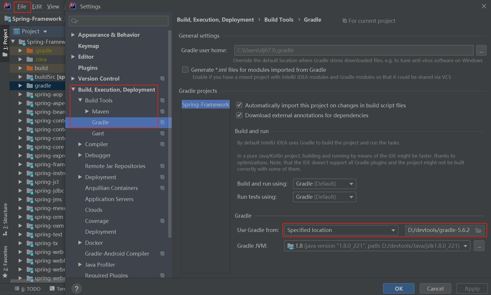
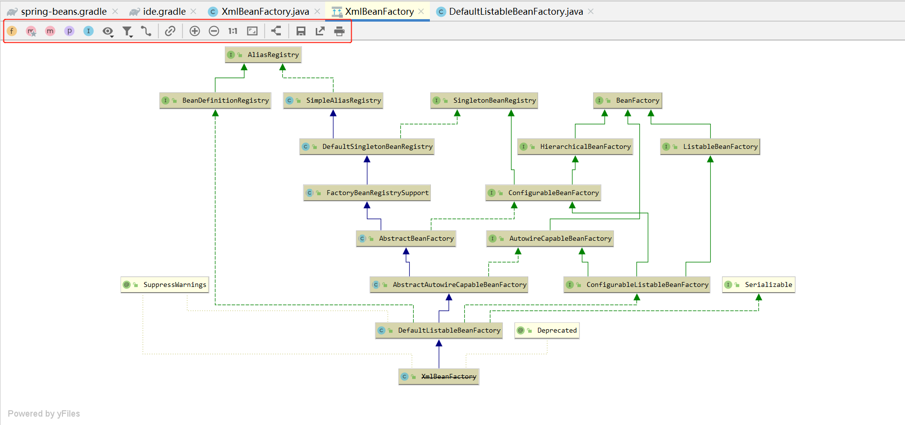

Spring-Framework 整体架构和源码调适环境搭建
====================
# 1、Spring-Framework 整体架构
一般地，我们说 Spring 通常指的是 Spring 家族，可以通过 https://spring.io/projects 查看主要项目，通过 [spring-framework-reference](https://docs.spring.io/spring/docs/5.1.13.RELEASE/spring-framework-reference/) 查阅官方文档。

## 1.1、为什么要看Spring源码

### 为什么要看Spring源码
- 解决使用框架时遇到的问题
- 深入理解底层原理，帮助更好的使用框架
- 深入理解面向对象思想和深入理解设计模式
- 高级程序员的常见面试点

### 如何看源码
- 确定主线，即想看那个流程的源码
- 找到流程入口
- 参考相关文档
- 寻找源代码规律

## 1.2、Spring-Framework 组件

### Spring-Framework 组件图

  
 

### Spring-Framework.5.1.x 代码结构

  
 

从组件图中，可以将 Spring-Framework 分为如下几个部分：

#### Core Container : 
Core Container(核心容器)包含有 Beans、Core、Context和Expression Language 模块：
- Beans  

#### AOP :

#### Data Access/Integration :

#### Web :

#### Test :

# 2、Spring-Framework.5.1.x 源码调适环境搭建

## 2.1、调适工具
- IntelliJ IDEA 2019.3
- gradle-5.6.2
- jdk1.8.0_221 ：注意 JDK 版本和 Spring-Framework 版本的兼容性。
- Spring-Framework.5.1.x ：从 [spring-framework 的 github 仓库](https://github.com/spring-projects/spring-framework)  clone 代码，网速慢的可以从 [spring-framework 的 gitee 仓库](https://gitee.com/mirrors/Spring-Framework) 获取。

## 2.2、IDEA 编译项目

Spring-Framework 代码 clone 完成之后，直接使用 IDEA 打开工程，设置自定义 gradle 版本

  
 

修改 gradle-wrapper.properties（Spring-Framework\gradle\wrapper\gradle-wrapper.properties）的 gradle-5.6.2-bin.zip 的版本号和自定义版本号保持一致。

等待项目编译完成（编译时间可能比较常），编译完成后如下图：

  
 

## 2.3、检测

### 使用测试用例检测

可调试 org.springframework.beans.factory.xml.XmlBeanDefinitionReaderTests 的 withFreshInputStream() 和 withImport() 这两个单元测试，相比来说，后者比前者多了一个 <import /> 标签的解析。

这里只执行一次 withFreshInputStream() 方法，验证环境有没有问题：

  
 

### 新建测试 Module 进行检测

# 3、win10 idea 源码调适快捷键

## 3.1、类图分析

- 打开类的 Diagram 视图 ：``Ctrl+Alt+Shift+Alt+U`` 或 鼠标右键 -> Diagrams -> Show Diagrams (Show Diagrams Popup 以浮窗的形式展示)

  
 

- ctrl + e : 查看最近打开的文件
- ctrl + { : 返回上一步编辑获取鼠标停留的位置
- ctrl + } : 返回下一步编辑获取鼠标停留的位置

- ctrl + g : 查看某方法被哪些地方调用
- Ctrl+Alt+H : 查看某方法的调用树
- ctrl + T : 查看某个类被某些地方调用（不包括实现的接口）

- F9            resume programe 恢复程序
- Alt+F10       show execution point 显示执行断点
- F8            Step Over 相当于eclipse的f6      跳到下一步
- F7            Step Into 相当于eclipse的f5就是  进入到代码
- Alt+shift+F7  Force Step Into 这个是强制进入代码
- Shift+F8      Step Out  相当于eclipse的f8跳到下一个断点，也相当于eclipse的f7跳出函数
- Atl+F9        Run To Cursor 运行到光标处
- ctrl+shift+F9   debug运行java类
- ctrl+shift+F10  正常运行java类
- alt+F8          debug时选中查看值

# 参考资料
- [闲聊如何阅读源码](https://v.qq.com/x/page/p0543tzm648.html)

