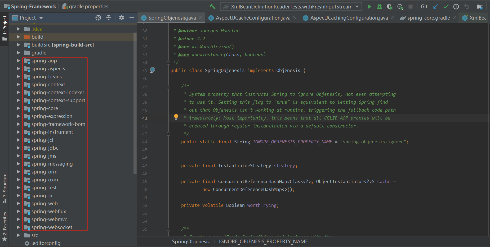

Spring-Framework 整体架构和源码调适环境搭建
====================
# 1、Spring-Framework 整体架构
一般地，我们说 Spring 通常指的是 Spring 家族，可以通过 https://spring.io/projects 查看主要项目，通过 [spring-framework-reference](https://docs.spring.io/spring/docs/5.1.13.RELEASE/spring-framework-reference/) 查阅官方文档。

## 1.2、Spring-Framework 组件

### Spring-Framework 组件图

  
 

### Spring-Framework.5.1.x 代码结构

  
 

从组件图中，可以将 Spring-Framework 分为如下几个部分：

#### Core Container :

#### AOP :

#### Data Access/Integration  :

#### Web :

#### Test :

# 2、Spring-Framework.5.1.x 源码调适环境搭建

- jdk1.8.0_221
- gradle-6.1.1
- IntelliJ IDEA 2019.3
- Spring-Framework.5.1.x

[spring-framework github](https://github.com/spring-projects/spring-framework)  

[spring-framework gitee](https://gitee.com/mirrors/Spring-Framework)

[我的 spring-framework gitee](https://gitee.com/abcart/Spring-Framework)

# 参考资料
- [闲聊如何阅读源码](https://v.qq.com/x/page/p0543tzm648.html)

