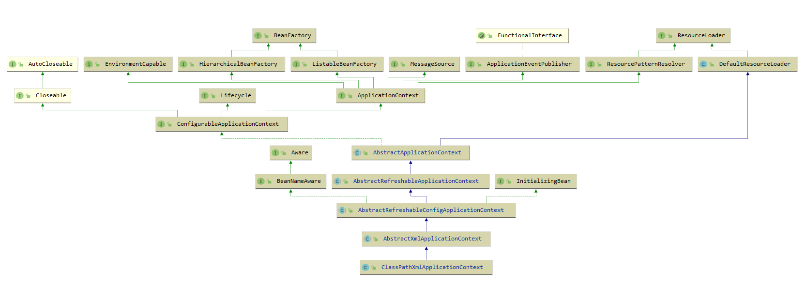
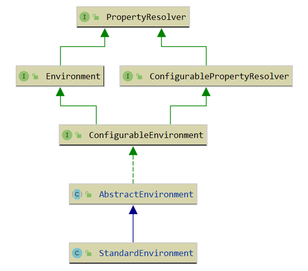

10.Spring Framework 源码分析之 IOC
====================
# 1、从 HELLO IOC 看 IOC 源码
本文以一个 hello ioc demo的视角来解读 Spring IOC, 需要的童鞋可以直接 clone 我的分支进行 debug :

```text
https://gitee.com/abcart/Spring-Framework/tree/feature-learn-5.1.x/
```

## HELLO IOC 伪代码

- ``build.gradle`` 依赖

```
dependencies {
    compile(project(":spring-context"))
}
```

- 接口及其实现类
```
public interface IocService {
    String holloIoc();
}

public class IocServiceImpl implements IocService {

    @Override
    public String holloIoc() {
        return "HELLO IOC";
    }
}

```

- 配置文件 application-ioc.xml
```
<?xml version="1.0" encoding="UTF-8"?>
<beans xmlns="http://www.springframework.org/schema/beans"
       xmlns:xsi="http://www.w3.org/2001/XMLSchema-instance"
       xsi:schemaLocation="http://www.springframework.org/schema/beans http://www.springframework.org/schema/beans/spring-beans.xsd">

    <bean id="iocService" class="org.springframework.app.service.impl.IocServiceImpl"/>

</beans>
```

- 执行入口
```
public class IocDemoApplication {

    public static void main(String[] args) {
        ApplicationContext context = new ClassPathXmlApplicationContext("classpath:application-ioc.xml");
        IocService iocService=context.getBean(IocServiceImpl.class);
        System.out.println("IocDemoApplication: "+iocService.holloIoc());
    }

}
```

从 IocDemoApplication 例子来看，打印 `HELLO IOC`，Spring 无非是做了如下几点工作：

- 读取配置文件 application-ioc.xml 
- 根据 bapplication-ioc.xml 中的配置找到对应的类的配置，并实例化
- 调用实例的方法

# 2、IOC 源码分析
 
### ClassPathXmlApplicationContext 的继承关系图：



### ClassPathXmlApplicationContext 源代码包含一个 Resource 数组和一堆 ClassPathXmlApplicationContext 构造方法，简述如下：
```java
public class ClassPathXmlApplicationContext extends AbstractXmlApplicationContext {

	// 配置文件容器
	@Nullable
	private Resource[] configResources;

    public ClassPathXmlApplicationContext(String configLocation) throws BeansException {
		// **
		this(new String[] {configLocation}, true, null);
	}

    	public ClassPathXmlApplicationContext(
			String[] configLocations, boolean refresh, @Nullable ApplicationContext parent)
			throws BeansException {
		// 根据父容器 new 一个 ClassPathXmlApplicationContext 对象
		super(parent);
		// 加载、解析 XML文件并将解析后的参数放在配置文件容器中 **
		setConfigLocations(configLocations);
		if (refresh) {
			// ***
			refresh();
		}
	}

}

```

## setConfigLocations() 解析

在加载、解析 XML 文件并将解析后的参数放在配置文件容器的过程中，setConfigLocations() 主要做了两件事情：

- 创建环境配置对象 ConfigurableEnvironment
- 处理 ClassPathXmlApplicationContext 传入的字符串中的占位符 

```java
public void setConfigLocations(@Nullable String... locations) {
    if (locations != null) {
        Assert.noNullElements(locations, "Config locations must not be null");
        this.configLocations = new String[locations.length];
        for (int i = 0; i < locations.length; i++) {
            // **
            this.configLocations[i] = resolvePath(locations[i]).trim();
        }
    }
    else {
        this.configLocations = null;
    }
}

protected String resolvePath(String path) {
    // setConfigLocations() 中做的两件事是在这完成的**
    return getEnvironment().resolveRequiredPlaceholders(path);
}

```

### 创建环境配置对象 ConfigurableEnvironment
```java
public ConfigurableEnvironment getEnvironment() {
    if (this.environment == null) {
        // **
        this.environment = createEnvironment();
    }
    return this.environment;
}

protected ConfigurableEnvironment createEnvironment() {
    return new StandardEnvironment();
}

public class StandardEnvironment extends AbstractEnvironment {

	/** System environment property source name: {@value}. */
	public static final String SYSTEM_ENVIRONMENT_PROPERTY_SOURCE_NAME = "systemEnvironment";

	/** JVM system properties property source name: {@value}. */
	public static final String SYSTEM_PROPERTIES_PROPERTY_SOURCE_NAME = "systemProperties";

	protected void customizePropertySources(MutablePropertySources propertySources) {
		propertySources.addLast(
				new PropertiesPropertySource(SYSTEM_PROPERTIES_PROPERTY_SOURCE_NAME, getSystemProperties()));
		propertySources.addLast(
				new SystemEnvironmentPropertySource(SYSTEM_ENVIRONMENT_PROPERTY_SOURCE_NAME, getSystemEnvironment()));
	}

}

```
StandardEnvironment 的继承关系图：



由这个继承关系图我们可以猜出 `getEnvironment().resolveRequiredPlaceholders(path)` 的处理逻辑是发生在这张图中，可以切换 methods 视图查看方法的依赖关系。

### 
```java
public String resolveRequiredPlaceholders(String text) throws IllegalArgumentException {
    // **
    return this.propertyResolver.resolveRequiredPlaceholders(text);
}

public String resolveRequiredPlaceholders(String text) throws IllegalArgumentException {
    if (this.strictHelper == null) {
        this.strictHelper = createPlaceholderHelper(false);
    }
    // **
    return doResolvePlaceholders(text, this.strictHelper);
}

private String doResolvePlaceholders(String text, PropertyPlaceholderHelper helper) {
    // **
    return helper.replacePlaceholders(text, this::getPropertyAsRawString);
}

public String replacePlaceholders(String value, PlaceholderResolver placeholderResolver) {
    Assert.notNull(value, "'value' must not be null");
    // ***
    return parseStringValue(value, placeholderResolver, null);
}

// 解析所有使用 ${} 方式的占位符
protected String parseStringValue(
        String value, PlaceholderResolver placeholderResolver, @Nullable Set<String> visitedPlaceholders) {

    int startIndex = value.indexOf(this.placeholderPrefix);
    if (startIndex == -1) {
        return value;
    }

    StringBuilder result = new StringBuilder(value);
    while (startIndex != -1) {
        int endIndex = findPlaceholderEndIndex(result, startIndex);
        if (endIndex != -1) {
            String placeholder = result.substring(startIndex + this.placeholderPrefix.length(), endIndex);
            String originalPlaceholder = placeholder;
            if (visitedPlaceholders == null) {
                visitedPlaceholders = new HashSet<>(4);
            }
            if (!visitedPlaceholders.add(originalPlaceholder)) {
                throw new IllegalArgumentException(
                        "Circular placeholder reference '" + originalPlaceholder + "' in property definitions");
            }
            // Recursive invocation, parsing placeholders contained in the placeholder key.
            placeholder = parseStringValue(placeholder, placeholderResolver, visitedPlaceholders);
            // Now obtain the value for the fully resolved key...
            String propVal = placeholderResolver.resolvePlaceholder(placeholder);
            if (propVal == null && this.valueSeparator != null) {
                int separatorIndex = placeholder.indexOf(this.valueSeparator);
                if (separatorIndex != -1) {
                    String actualPlaceholder = placeholder.substring(0, separatorIndex);
                    String defaultValue = placeholder.substring(separatorIndex + this.valueSeparator.length());
                    propVal = placeholderResolver.resolvePlaceholder(actualPlaceholder);
                    if (propVal == null) {
                        propVal = defaultValue;
                    }
                }
            }
            if (propVal != null) {
                // Recursive invocation, parsing placeholders contained in the
                // previously resolved placeholder value.
                propVal = parseStringValue(propVal, placeholderResolver, visitedPlaceholders);
                result.replace(startIndex, endIndex + this.placeholderSuffix.length(), propVal);
                if (logger.isTraceEnabled()) {
                    logger.trace("Resolved placeholder '" + placeholder + "'");
                }
                startIndex = result.indexOf(this.placeholderPrefix, startIndex + propVal.length());
            }
            else if (this.ignoreUnresolvablePlaceholders) {
                // Proceed with unprocessed value.
                startIndex = result.indexOf(this.placeholderPrefix, endIndex + this.placeholderSuffix.length());
            }
            else {
                throw new IllegalArgumentException("Could not resolve placeholder '" +
                        placeholder + "'" + " in value \"" + value + "\"");
            }
            visitedPlaceholders.remove(originalPlaceholder);
        }
        else {
            startIndex = -1;
        }
    }
    return result.toString();
}
```

## refresh() 解析
refresh() 是初始化 ClassPathXmlApplicationContext 核心的方法，篇幅很长，先来一个代码概述：

```java
public void refresh() throws BeansException, IllegalStateException {
    // 为了避免 refresh() 还没结束，再次发起启动或者销毁容器引起冲突
    synchronized (this.startupShutdownMonitor) {
        // 1.refresh context 准备工作 **
        prepareRefresh();

        // 2.刷新、获取 BeanFactory
        // 负责 BeanFactory 的初始化、Bean 的加载和注册等事件 **
        ConfigurableListableBeanFactory beanFactory = obtainFreshBeanFactory();

        // 3.BeanFactory 使用前的准备工作
        // 设置 BeanFactory 的类加载器、添加 BeanPostProcessor、手动注册几个特殊的 bean **
        prepareBeanFactory(beanFactory);

        try {
            // 4.(扩展点) context 子类对 BeanFactory 的后置处理 
            postProcessBeanFactory(beanFactory);

            // 5.实例化并调用所有注册了 BeanFactoryPostProcessor 的 bean **
            invokeBeanFactoryPostProcessors(beanFactory);

            // 6.注册 BeanPostProcessor 的实现类，注意不是BeanFactoryPostProcessor
            // 此接口有两个方法: postProcessBeforeInitialization 和 postProcessAfterInitialization分别会在Bean初始化之前和初始化之后得到执行
            registerBeanPostProcessors(beanFactory);

            // 7.初始化 context 的 MessageSource(消息源的国际化) **
            initMessageSource();

            // 8.初始化 context 的事件广播器 **
            initApplicationEventMulticaster();

            // 9.(扩展点)在特定的 context 子类初始化特殊的 bean
            onRefresh();

            // 10.注册事件监听器 **
            registerListeners();

            // 11.实例化所有未实例化（非延迟初始化）的单例 bean **
            finishBeanFactoryInitialization(beanFactory);

            // 12.发布相应的事件 **
            finishRefresh();
        }

        catch (BeansException ex) {
            // 销毁已经初始化的的 bean
            destroyBeans();
            // 设置 'active' 状态
            cancelRefresh(ex);
            throw ex;
        }

        finally {
            // 清除缓存
            resetCommonCaches();
        }
    }
}

```


